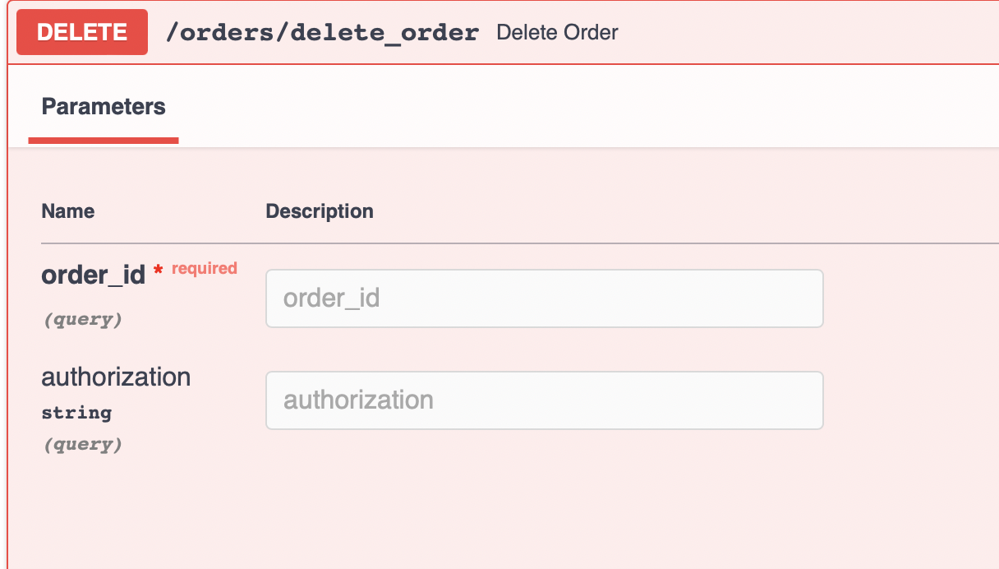

    
    
    
    
    
    

## Клонируем репозиторий:

    git clone https://github.com/Mitsufiro/flower_shop

## Развертывание

`docker-compose up`

## Migrations

При изменении модели данных необходимо создать миграцию

`docker exec app alembic revision --autogenerate -m "New Migration"`

Для применения изменений, необходимо запустить

`docker exec app alembic upgrade head`

Запуск проекта

`docker-compose up`

* Создание юзера.

* Вход.

* При входе заполняем данные пользователя и просто берем access token, который нам необходим для использования методов.

* Далее в зависиммости от прав юзера можем использовать методы.

* Получение refresh токена.

* Выход. Токен добавляется в черный список, при входе черный список очищается.

* Получение информации о текущем юзере.

* Получение списка всех юзеров.

* Получение подробной информации по id юзера.

* Постраничное получение подробной информации всех юзеров.

* Изменение информации по id юзера. Чтобы изменить конкретное поле, то достаточно оставить только его.

## Finally:

* Удаление по id юзера.

* Получение информации обо всех цветах в базе данных.

* Получение конкретного вида цветов по id.

* Добавление новых цветов в БД.

* Получение подробной информации по id юзера.

* Удаление цветка из БД.

* Получение всех заказов.

* Создание заказа в который в последствии можно будет добавлять цветы.

* Получение информации о заказе по id заказа.

* Удаление заказа по его id.

* Получение информации о добавлении цветов в заказы. Может понадовиться для статистики.

* Добавление цветов в заказ. При добавлении изменяется общая стоимость заказа, если это новый вид цветов, которого не
  было ранее в заказе, то это указывается в описании заказа.

* Добавляем несколько разных цветов с разным количеством, ранее уже были добавлены Розы, Астры и Лилии в ассортимент
  магазина:
  

  

  

* Смотрим заказ в который мы все добавили:
  

• Реализован ролевой доступ к API-методам в зависимости от уровня прав пользователя.

• Настроена валидация данных.

• Swagger.

• Подготовлен docker-контейнер с сервисами.

• Универсальный CRUD.

• Написаны тесты для эндпоинтов.

• Реализация асинхронных методов.

• Настроено опциональное изменение данных пользователей (Чтобы изменить нужное поле необходимо оставить только его).

• Настроена аутентификация (Доступ к методам производится путем подачи токена со стороны пользователя).

